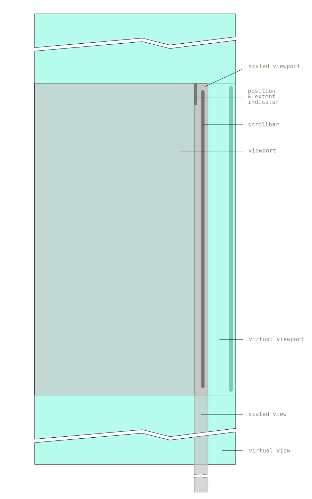

# Virtual view implementation

Display a (very) large list of rows with good performance by only adding dom elements for the visible rows and recycle them when the visible section changes.

## Motivation

- Handle scaling to get around the browser max client height (see [why it's needed](https://github.com/bvaughn/react-virtualized/issues/396))
- Native scrollbars.

## Out of scope

- Headers and footers.
- Varying row height; all rows need to have the same height, and a placeholder row should already have its size set.

## Usage

Import the javascript module (esm). It registers a custom element with the name `list-view`, and it exports the custom element class (both as default and `ListView`).

There's a [type definition here](listview.d.ts). 

You need to set a `ListModel` on the `ListView`'s `model` property. 
The `ListModel` needs to have 3 members:
  - `count` 
  It can be a number or a function returning a number.
  - `createPlaceholderRow` 
  A function that returns the dom element to use for a row. It needs to have the correct size even before being bound to a specific row.
  - `render` 
  A function that modified the placeholder element to diplay the row at the specified index. 
  It has 2 arguments:
    - `placeholderRow` 
    A dom element created from the previous function
    - `index` 
    The (0-based) index of the row to bind to the placeholder dom element. 
    

## Example

There's [an example](index.html) that displays content as hexadecimal. You can drag and drop or paste any file into the page to show its content.

## Design

There are actually two scroll containers.
- The first one is for the visible scrollbar, and it's only wide enough to show the scrollbar itself, and possibly an extra gutter for the position and extent indicator (not currently implemented). 
When there are too many rows, the view gets scaled. This is not noticeable because it happens after the thumb size reaches its minimum height.
- The second one is for the virtual view, holding the visible rows. Its scrollbar is offset out of the view on the right. 
There are enough rows for the visible area, but also for a full page up and down so that we don't notice the recycling while scrolling. 

If the user interacts with the scroll bar directly, it's with the scaled container scrollbar. Otherwise, drags, mouse wheel ups and downs, arrows, and page ups and downs all happen directly on the virtual view.

